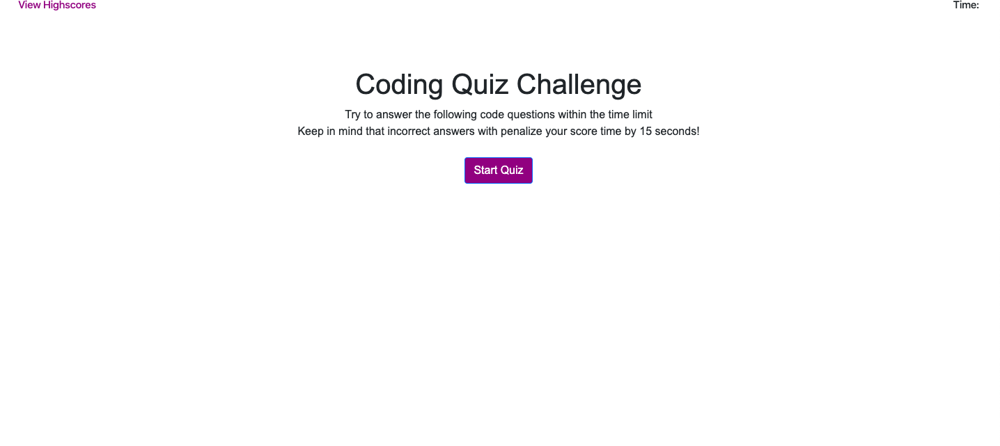

# Code Quiz:

This repo is composed of 4 pages
Index.html / style.css / script.js / questions.js
A coding quiz composed of 5 questions to test the users knowlegdge on programming 
75 second timer that counts down from the start of the quiz to the end of the questions or time runs out
As well as local storage that stores high scores

## Github pages:

This is where the main website/repo where the application will be launched.

## Langauges Used:

HTML 
CSS
BOOTSTRAP
JAVASCRIPT/JQUERY

## Contributing:
Pull requests are welcome. For major changes, please open an issue first to discuss what you would like to change.

Please make sure to update tests as appropriate.

## Links:
https://github.com/BrennanPredmore/codeQuiz
https://brennanpredmore.github.io/codeQuiz/

## License
No License required. These are public pages. 

